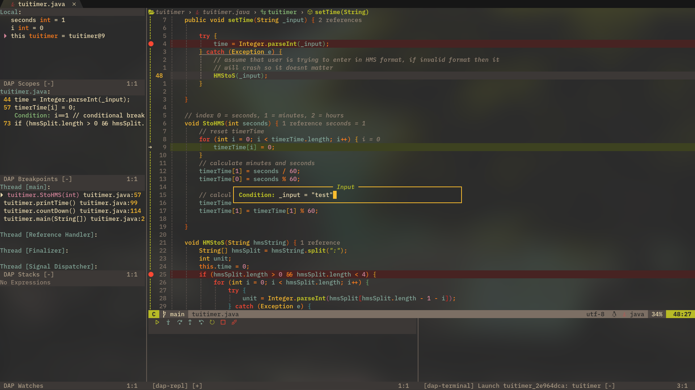

# Neovim config

## Screenshot

Info:
* Font: CaskaydiaCove NFM

## Differences

* Mostly transparent
    * Transparency is disabled for neovide as it doesn't support it
* Statusline representing the mode is only character in length (idk why but I love this so much)

## Important note for windows users

Make sure to install the following with scoop:
* gcc
* fzf

## Problems

* Statusline will flash with stuff like "--INSERT--" when LSP is active.
